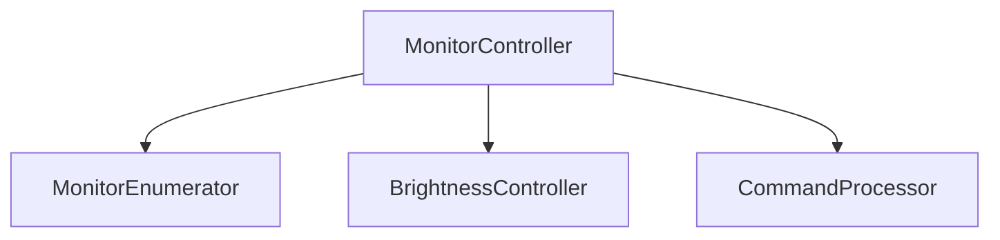

# システムパターンと設計決定

## アーキテクチャパターン

### 1. コンポーネント分割


- **決定理由**: 単一責任の原則に基づく明確な関心の分離
- **利点**: テスト容易性、保守性の向上
- **トレードオフ**: 若干のパフォーマンスオーバーヘッド

### 2. リソース管理
```cpp
// RAIIパターンによるリソース管理
class MonitorHandle {
    HANDLE m_handle;
public:
    MonitorHandle(HANDLE h) : m_handle(h) {}
    ~MonitorHandle() { if (m_handle) CloseHandle(m_handle); }
};
```

- **決定理由**: Windows APIリソースの安全な管理
- **利点**: リソースリークの防止、例外安全性
- **使用箇所**: モニターハンドル、APIリソース

### 3. エラーハンドリング
```cpp
class DisplayControllerException : public std::runtime_error {};
class WindowsApiException : public DisplayControllerException {};
class InvalidArgumentException : public DisplayControllerException {};
```

- **パターン**: 階層化された例外クラス
- **目的**: エラーの種類に基づく適切な処理
- **処理方針**:
  - API エラー: WindowsApiException
  - 引数エラー: InvalidArgumentException
  - その他: DisplayControllerException

## 実装パターン

### 1. モニター操作
- 輝度値の正規化（0-100範囲）
- 非同期操作の同期的実行
- エラー状態の詳細なログ

### 2. コマンド処理
```cpp
// コマンドパターン
class Command {
public:
    virtual bool Execute() = 0;
    virtual ~Command() = default;
};
```

- **使用理由**: コマンドライン操作の整理
- **実装**: 各操作を個別のコマンドクラスとして実装

### 3. モニター列挙
- Windows APIコールのラッピング
- デバイス情報のキャッシング
- 列挙結果の検証

## テストパターン

### 1. 単体テスト
- モックオブジェクトによるAPI分離
- エッジケースの網羅
- 例外発生シナリオの検証

### 2. 結合テスト
- 実モニター環境でのテスト
- 異なるモニター構成での検証
- エラー状態の再現

## 採用技術とバージョン
- C++ 17
- Windows SDK 10.0
- Visual Studio 2022
- CMake 3.29.8
