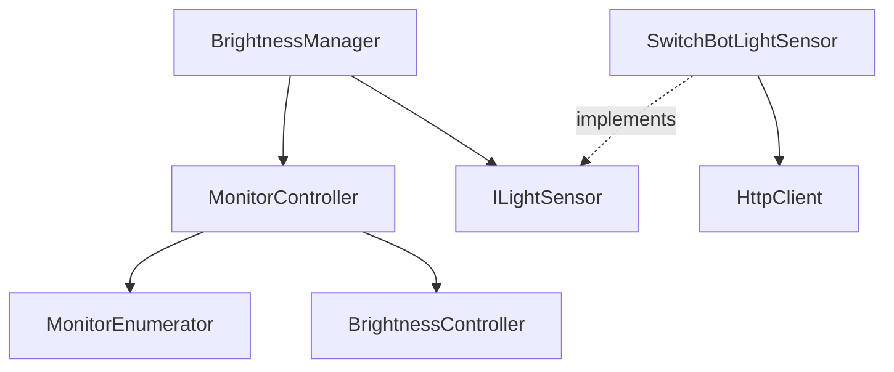
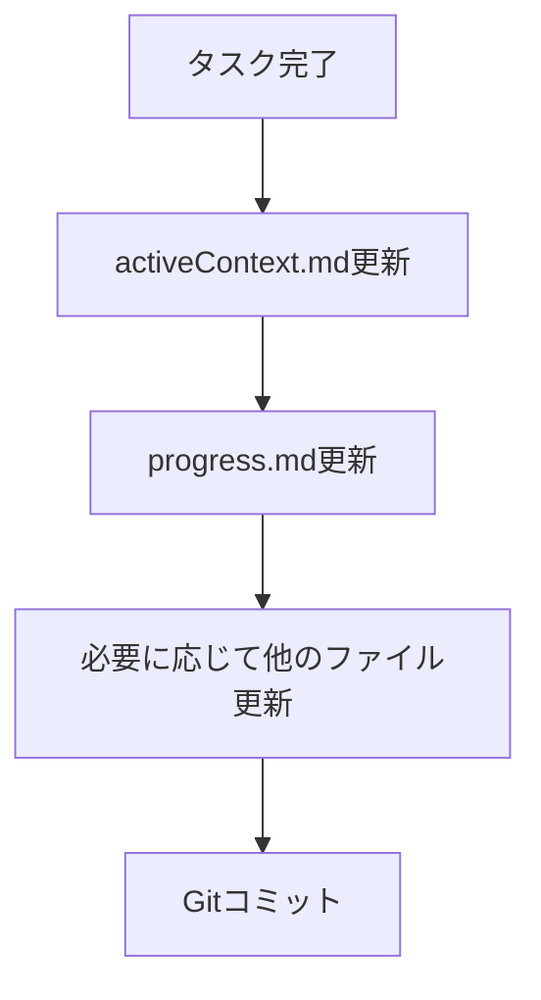

# システムパターンと設計決定

## アーキテクチャパターン

### 1. コンポーネント分割


- **決定理由**: 単一責任の原則と依存性逆転の原則に基づく設計
- **利点**: テスト容易性、保守性、拡張性の向上
- **トレードオフ**: 若干の複雑性増加

### 2. インターフェース抽象化
```cpp
// 照度センサーの抽象化
class ILightSensor {
public:
    virtual ~ILightSensor() = default;
    virtual int GetLightLevel() = 0;
};

// HTTP通信の抽象化
class IHttpClient {
public:
    virtual ~IHttpClient() = default;
    virtual std::string Get(const std::string& url) = 0;
};
```

- **目的**: テスト容易性と拡張性の確保
- **利点**: モック化が容易、実装の差し替えが可能
- **使用箇所**: センサー実装、HTTP通信

### 3. リソース管理
```cpp
// RAIIパターンによるリソース管理
class MonitorHandle {
    HANDLE m_handle;
public:
    MonitorHandle(HANDLE h) : m_handle(h) {}
    ~MonitorHandle() { if (m_handle) CloseHandle(m_handle); }
};

// スレッド管理
class SyncThread {
    std::thread m_thread;
    std::atomic<bool> m_running;
public:
    void Start() { m_running = true; }
    void Stop() { m_running = false; }
};
```

- **決定理由**: 安全なリソース管理とスレッド制御
- **利点**: リソースリーク防止、例外安全性
- **使用箇所**: モニターハンドル、同期スレッド

### 4. エラー出力の標準化
```cpp
class StringUtils {
public:
    // エラーメッセージをコンソールに出力
    static void OutputErrorMessage(const std::string& message);

    // 例外からエラーメッセージを抽出して出力
    static void OutputExceptionMessage(const std::exception& e);

    // 文字コード変換
    static std::string WideToUtf8(const std::wstring& wide);
    static std::wstring Utf8ToWide(const std::string& utf8);
};
```

- **パターン**: 統一的なエラー出力
- **目的**: 文字化けのない一貫したエラーメッセージ表示
- **処理方針**:
  * UTF-8での内部管理
  * Windows APIによる確実な文字出力
  * エラーメッセージの標準化

### 5. エラーハンドリング
```cpp
// 基本例外クラス
class DisplayControllerException : public std::runtime_error {};

// 具体的な例外クラス
class WindowsApiException : public DisplayControllerException {};
class InvalidArgumentException : public DisplayControllerException {};
class SwitchBotException : public DisplayControllerException {};
```

- **パターン**: 階層化された例外クラス
- **目的**: エラーの種類に基づく適切な処理
- **処理方針**:
  * API エラー: WindowsApiException
  * 引数エラー: InvalidArgumentException
  * SwitchBot関連: SwitchBotException

## 実装パターン

### 1. モニター操作
- 輝度値の正規化（0-100範囲）
- 非同期操作の同期的実行
- エラー状態の詳細なログ

### 2. 自動輝度調整
```cpp
class BrightnessManager {
    void SyncLoop() {
        while (m_running) {
            try {
                int light = m_sensor->GetLightLevel();
                int brightness = CalculateBrightness(light);
                m_controller->SetBrightness(brightness);
            } catch (...) {
                HandleError();
            }
            std::this_thread::sleep_for(m_interval);
        }
    }
};
```

- **パターン**: Producer-Consumer
- **特徴**:
  * 定期的なセンサー値取得
  * エラー時のフォールバック
  * 設定可能な更新間隔

### 3. HTTP通信
```cpp
class HttpClient {
    curl_easy_setopt(m_curl, CURLOPT_WRITEFUNCTION, WriteCallback);
    curl_easy_setopt(m_curl, CURLOPT_TIMEOUT, 5L);
    curl_easy_setopt(m_curl, CURLOPT_CONNECTTIMEOUT, 3L);
};
```

- **パターン**: libcurlラッパー
- **特徴**:
  * タイムアウト設定
  * 自動リトライ
  * エラーハンドリング

### 4. SwitchBotデバイス対応
```cpp
class SwitchBotLightSensor {
    int GetLightLevel() {
        auto status = GetDeviceStatus();
        if (!status["body"].contains("lightLevel")) {
            throw SwitchBotException("デバイスの応答に照度データが含まれていません");
        }
        return NormalizeLightLevel(status["body"]["lightLevel"].get<int>());
    }
};
```

- **パターン**: 機能ベースのデバイス検出
- **特徴**:
  * デバイスタイプではなく機能（lightLevelフィールド）に基づく判定
  * 柔軟なデバイス対応
  * エラー時の適切なフォールバック

## テストパターン

### 1. 単体テスト
- モックオブジェクトによるAPI分離
- エッジケースの網羅
- 例外発生シナリオの検証

### 2. 結合テスト
- 実モニター環境でのテスト
- SwitchBotデバイスとの通信テスト
- エラー状態の再現

### 3. モック実装
```cpp
class MockLightSensor : public ILightSensor {
public:
    MOCK_METHOD(int, GetLightLevel, (), (override));
};

class MockHttpClient : public IHttpClient {
public:
    MOCK_METHOD(std::string, Get, (const std::string&), (override));
};
```

## タスク完了時のワークフロー

### 1. メモリバンク更新


- **更新対象**:
  * activeContext.md: 完了したタスクの記録
  * progress.md: 進捗状況の更新
  * systemPatterns.md: 新しいパターンの追加
  * その他関連ファイル

- **更新内容**:
  * 実装した機能の説明
  * 重要な技術的決定
  * 次のステップの更新
  * 新しく発見したパターン

### 2. Gitコミット
```bash
# コミットメッセージの形式
feat: 機能名や変更の概要

- 詳細な変更内容
- 影響範囲
- テスト結果

🤖 ${K4}で生成
```

- **コミットタイミング**:
  * 機能実装完了時
  * バグ修正完了時
  * リファクタリング完了時
  * メモリバンク更新後

- **コミット内容**:
  * ソースコードの変更
  * メモリバンクの更新
  * ドキュメントの更新
  * テストコードの追加

## 採用技術とバージョン
- C++ 17
- Windows SDK 10.0
- Visual Studio 2022
- CMake 3.29.8
- vcpkg (パッケージ管理)
- libcurl 8.4.0
- nlohmann/json 3.11.2
- GoogleTest 1.14.0
