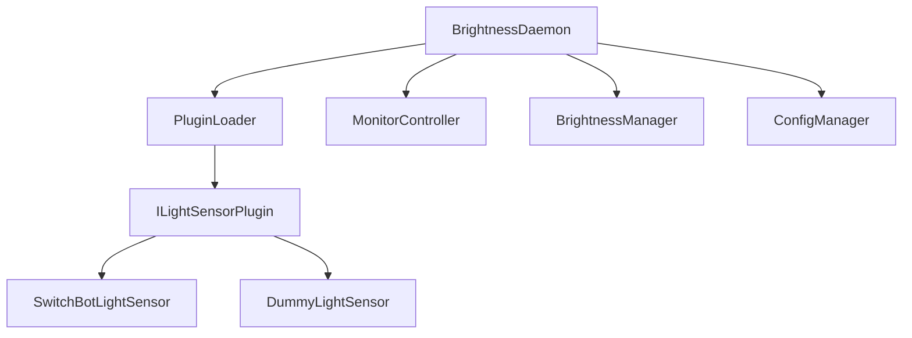

# アーキテクチャ概要

DisplayControllerは、環境光センサーを使用してモニターの明るさを自動調整するシステムです。プラグインベースのアーキテクチャを採用し、様々なセンサーデバイスに対応可能な設計となっています。

## システム構成



## コアコンポーネント

### BrightnessDaemon
システム全体を制御する中心的なコンポーネント。以下の機能を担当：
- プラグインの初期化と管理
- 明るさ制御のメインループ
- 設定の読み込みと適用

### PluginLoader
プラグインの動的読み込みを担当：
- プラグインDLLの読み込み
- プラグインインスタンスの作成
- プラグインのライフサイクル管理

### MonitorController
モニターの制御を担当：
- Windows Display Device APIを使用したモニター制御
- 明るさ設定の適用
- モニター情報の取得

### BrightnessManager
明るさ制御のロジックを担当：
- センサー値の処理
- 明るさの計算
- スムージング処理

### ConfigManager
設定の管理を担当：
- 設定ファイルの読み込み
- 設定値の検証
- プラグイン設定の管理

## プラグインアーキテクチャ

### プラグインインターフェース

```cpp
class ILightSensorPlugin {
public:
    virtual ~ILightSensorPlugin() = default;
    virtual const char* GetPluginName() const = 0;
    virtual const char* GetPluginVersion() const = 0;
    virtual std::unique_ptr<ILightSensor> CreateSensor(
        const json& config
    ) = 0;
};

class ILightSensor {
public:
    virtual ~ILightSensor() = default;
    virtual float GetLightLevel() = 0;
    virtual bool IsConnected() = 0;
};
```

### プラグイン実装要件
1. `ILightSensorPlugin`インターフェースの実装
2. 必要なエクスポート関数の提供
   ```cpp
   extern "C" {
       PLUGIN_API ILightSensorPlugin* CreatePlugin();
       PLUGIN_API void DestroyPlugin(ILightSensorPlugin* plugin);
   }
   ```
3. プラグイン固有の設定のサポート

## データフロー

1. 設定ファイルの読み込み
2. プラグインの初期化
3. センサーの作成
4. メインループ：
   - センサー値の取得
   - 明るさ値の計算
   - モニター明るさの設定

## エラーハンドリング

### 主要なエラーケース
- プラグイン読み込みエラー
- 設定ファイルエラー
- センサー接続エラー
- モニター制御エラー

### エラー処理方針
- 詳細なエラーメッセージの提供
- エラーログの記録
- 適切なフォールバック動作
- リソースの適切な解放

## セキュリティ考慮事項

1. プラグインの検証
   - 署名の確認
   - バージョンの確認
   - 権限の制限

2. 設定ファイルの検証
   - JSONスキーマによる検証
   - 値の範囲チェック
   - 必須項目の確認

3. エラー時の安全な動作
   - デフォルト値の使用
   - 安全なフォールバック
   - クリーンアップの保証

## パフォーマンス最適化

1. プラグイン読み込みの最適化
   - 遅延読み込み
   - キャッシング

2. センサー値の処理
   - 適切なポーリング間隔
   - スムージング処理
   - バッファリング

3. モニター制御
   - 不要な更新の抑制
   - バッチ処理

## 将来の拡張性

1. 新機能の追加
   - 追加のセンサータイプ
   - 高度な制御アルゴリズム
   - UIコンポーネント

2. プラグインシステムの拡張
   - プラグインの動的更新
   - 依存関係管理
   - プラグイン間通信

3. モニタリングと管理
   - 詳細なログ機能
   - 統計情報の収集
   - リモート管理機能
