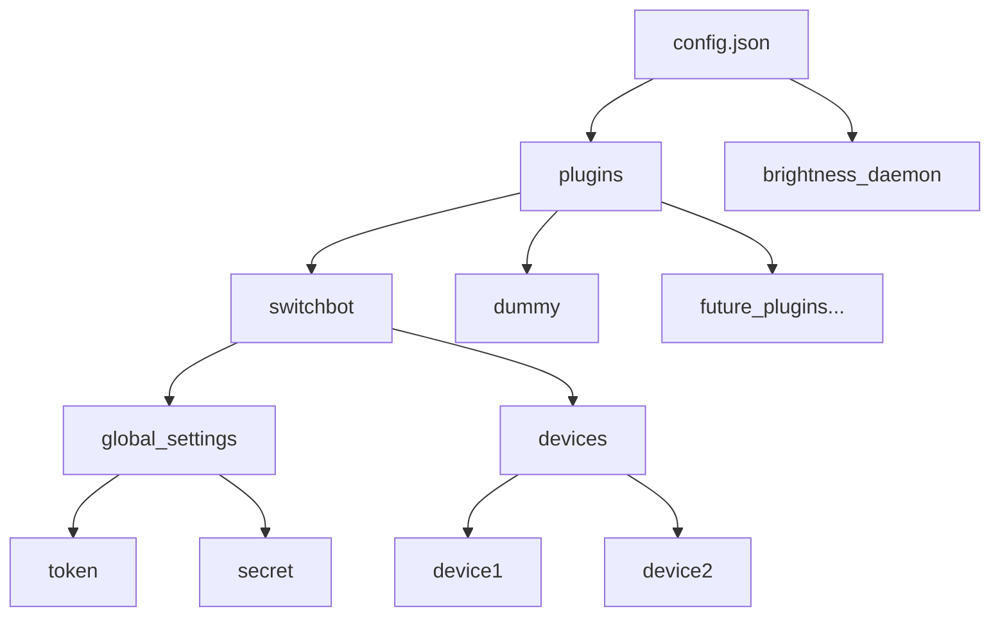

# プラグイン設定構造の再設計

## 概要
SwitchBotがプラグインの一つとなったことに伴い、設定ファイルの構造を見直し、より適切なプラグインベースの構造に移行します。

## 現状の問題
1. SwitchBotの設定がルートレベルにあり、プラグインアーキテクチャと整合性が取れていない
2. プラグイン固有の設定（token, secret）がグローバルな場所にある
3. 新しいプラグインを追加する際の設計指針が不明確

## 新しい構造

### 設定階層図


### 設定ファイル例
```json
{
  "plugins": {
    "switchbot": {
      "global_settings": {
        "token": "YOUR_SWITCHBOT_API_TOKEN",
        "secret": "YOUR_SWITCHBOT_API_SECRET"
      },
      "devices": [
        {
          "id": "YOUR_DEVICE_ID",
          "name": "Light Sensor 1",
          "type": "Light Sensor",
          "description": "リビングの照度センサー",
          "calibration": {
            "min_raw_value": 100,
            "max_raw_value": 800
          }
        }
      ]
    },
    "dummy": {
      "devices": [
        {
          "name": "Dummy Sensor 1",
          "type": "Light Sensor"
        }
      ]
    }
  },
  "brightness_daemon": {
    "update_interval_ms": 5000,
    "min_brightness": 0,
    "max_brightness": 100
  }
}
```

## 利点
1. プラグインごとに明確に分離された設定領域
2. プラグイン固有の設定をプラグインの名前空間内に配置
3. 将来的なプラグインの追加が容易
4. 設定の階層構造が明確

## 移行計画

### 1. ConfigManagerの拡張
- プラグイン設定へのアクセス方法の追加
- 後方互換性のための移行ロジック実装

### 2. プラグインの更新
- 設定読み込みロジックの更新
- エラーハンドリングの強化

### 3. テスト計画
- 新しい設定構造のバリデーション
- 移行ロジックのテスト
- エラーケースの検証

## 実装の注意点
1. 既存の設定ファイルの自動移行サポート
2. エラーメッセージの明確化
3. プラグイン設定のバリデーション強化
