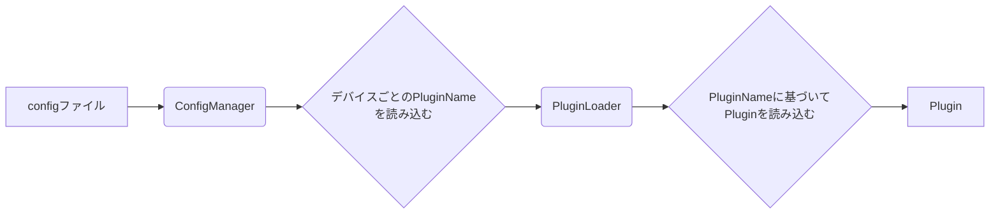

# configのデバイスごとにPluginNameを指定して、どのPluginを読み込むかを決定する

## 概要

configファイルにデバイスごとにPluginNameを指定して、どのPluginを読み込むかを決定するようにします。

## 現状の把握

*   `BrightnessDaemon.cpp`が主な処理を行うファイルであると推測できます。
*   `ILightSensorPlugin.h`は、Pluginのインターフェースを定義していると思われます。
*   `ConfigManager`がconfigファイルを読み込んでいる可能性があります。
*   `PluginLoader`がPluginを読み込んでいる可能性があります。
*   `docs/`ディレクトリには、設計に関するドキュメントがいくつか存在します。

## 不明点の確認

*   configファイルの形式は？
*   configファイルはどこに保存されている？
*   デバイスとは具体的に何を指す？
*   Pluginの読み込み処理はどこで行われている？
*   既存のPluginはどのように定義されている？

## 計画

1.  configファイルの形式と場所を特定する。
2.  `ConfigManager`のコードを読んで、configファイルの読み込み処理を理解する。
3.  `PluginLoader`のコードを読んで、configファイルの読み込み処理を理解する。
4.  configファイルにデバイスごとのPluginNameを指定する形式を追加する。
5.  `ConfigManager`で、デバイスごとのPluginNameを読み込む処理を追加する。
6.  `PluginLoader`で、デバイスごとのPluginNameに基づいてPluginを読み込む処理を追加する。
7.  テストコードを追加して、変更が正しく動作することを確認する。
8.  ドキュメントを更新する。

## Mermaid図

## 変更点

1.  `ConfigManager.cpp`を修正して、`pluginName`のバリデーションと`GetPluginName`関数を追加する。
2.  `BrightnessDaemon.cpp`を修正して、`ConfigManager::GetPluginName`を呼び出して`pluginName`を取得し、`PluginLoader::CreateSensor`を呼び出すように変更する。
